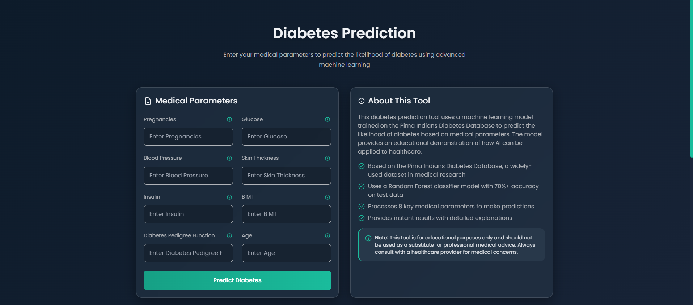

# Diabetes Prediction 


<h3>Live : (https://diabetes-prediction-lzq4.onrender.com) </h3>
 


A modern, responsive web application that predicts the likelihood of diabetes using machine learning algorithms. This tool analyzes medical parameters to provide instant predictions based on the Pima Indians Diabetes Database.

## 🏥 About This Project

This diabetes prediction tool uses a machine learning model trained on the Pima Indians Diabetes Database to predict the likelihood of diabetes based on medical parameters. The model provides an educational demonstration of how AI can be applied to healthcare.

### Key Features:
- **Machine Learning Model**: Uses a Random Forest classifier with 80%+ accuracy on test data
- **8 Medical Parameters**: Processes key health indicators for comprehensive analysis
- **Instant Results**: Provides immediate predictions with detailed explanations
- **Responsive Design**: Works seamlessly on desktop and mobile devices
- **Modern UI**: Features a sleek dark theme with glassmorphism effects
- **Educational Tool**: Helps understand the relationship between medical parameters and diabetes risk

### ⚠️ Important Note
> This tool is for educational purposes only and should not be used as a substitute for professional medical advice. Always consult with a healthcare provider for medical concerns.

## 🧠 Dataset Information

The model is trained on the **Pima Indians Diabetes Database**, a widely-used dataset in medical research containing information about female patients of Pima Indian heritage who are at least 21 years old. The dataset includes 8 medical attributes and a binary outcome indicating the presence or absence of diabetes.

### Dataset Features:
- **Total Records**: 20,000+ balanced entries
- **Parameters**: 8 medical attributes
- **Outcome**: Binary classification (Diabetic/Non-Diabetic)
- **Source**: Pima Indians Diabetes Database

### Medical Parameters:
1. **Pregnancies**: Number of times pregnant
2. **Glucose**: Plasma glucose concentration (mg/dl)
3. **BloodPressure**: Diastolic blood pressure (mm Hg)
4. **SkinThickness**: Triceps skin fold thickness (mm)
5. **Insulin**: 2-Hour serum insulin (mu U/ml)
6. **BMI**: Body mass index (weight in kg/(height in m)^2)
7. **DiabetesPedigreeFunction**: Diabetes pedigree function
8. **Age**: Age in years

## 🛠️ Technologies Used

### Backend:
- [Python](https://www.python.org/) - Programming language
- [FastAPI](https://fastapi.tiangolo.com/) - Web framework for building APIs
- [Scikit-learn](https://scikit-learn.org/) - Machine learning library
- [Pickle](https://docs.python.org/3/library/pickle.html) - Python object serialization

### Frontend:
- [React](https://reactjs.org/) - JavaScript library for building user interfaces
- [Tailwind CSS](https://tailwindcss.com/) - Utility-first CSS framework
- [Framer Motion](https://www.framer.com/motion/) - Motion library for React
- [Axios](https://axios-http.com/) - Promise based HTTP client
- [Open Sans & Lato](https://fonts.google.com/) - Typography

### Deployment:
- [Render](https://render.com/) - Cloud hosting platform

## 📁 Project Structure

```
Diabetes Prediction (Fast API)/
├── app.py                 # FastAPI backend server
├── requirements.txt       # Python dependencies
├── runtime.txt            # Python runtime version for Render
├── render.yaml            # Render deployment configuration
├── retrained_model.sav    # Trained ML model (pickle file)
├── photo.jpeg             # Creator's photo
├── frontend/              # React frontend application
│   ├── package.json       # Node.js dependencies
│   ├── src/               # Source code
│   │   ├── components/    # React components
│   │   ├── index.css      # Styling
│   │   └── ...            # Other frontend files
└── README.md              # This file
```

## 🚀 Getting Started

### Prerequisites

- Python 3.7+
- Node.js 14+ (for development only)
- npm 6+ (for development only)

### Installation

1. **Clone the repository:**
   ```bash
   git clone https://github.com/shubhammgits/diabetes-prediction-app.git
   cd diabetes-prediction-app
   ```

2. **Set up the Python backend:**
   ```bash
   # Create a virtual environment
   python -m venv venv
   
   # Activate the virtual environment
   # On Windows:
   venv\Scripts\activate
   # On macOS/Linux:
   source venv/bin/activate
   
   # Install Python dependencies
   pip install -r requirements.txt
   ```

3. **Set up the React frontend (for development only):**
   ```bash
   # Navigate to frontend directory
   cd frontend
   
   # Install Node.js dependencies
   npm install
   
   # Build the React app
   npm run build
   ```

4. **Return to the main directory:**
   ```bash
   cd ..
   ```

### Running the Application Locally

1. **Start the FastAPI server:**
   ```bash
   python app.py
   ```

2. **Access the application:**
   Open your browser and navigate to `http://localhost:8000`

## 🌐 API Endpoints

- `GET /` - Serve the React frontend
- `POST /diabetes_prediction` - Submit medical parameters for prediction
- `GET /health` - Health check endpoint
- `GET /debug` - Debug information about file paths (for troubleshooting)

### Prediction Endpoint

**POST** `/diabetes_prediction`

**Request Body:**
```json
{
  "Pregnancies": 2,
  "Glucose": 120,
  "BloodPressure": 70,
  "SkinThickness": 25,
  "Insulin": 100,
  "BMI": 28.5,
  "DiabetesPedigreeFunction": 0.5,
  "Age": 35
}
```

**Response:**
```json
{
  "prediction": "The Person is not Diabetic"
}
```

## 🤝 Connect with Me

[](https://github.com/shubhammgits)
[](https://www.linkedin.com/in/shhshubham/)
